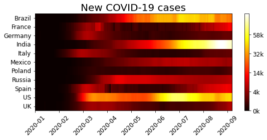
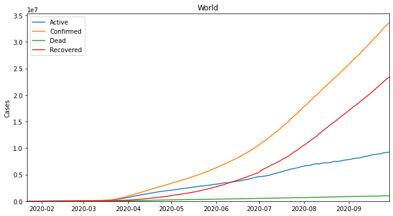
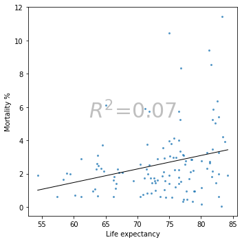
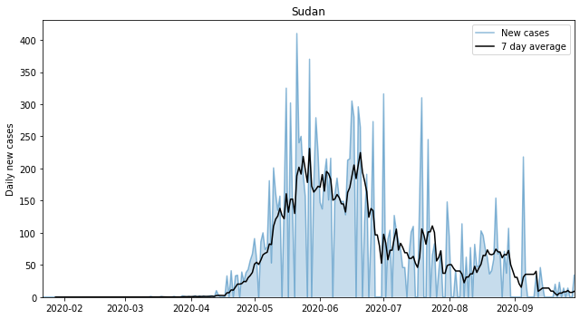

# COVID-19 Pandemic Analysis

**Reproducible Python pipeline + EDA on the first ten months of the pandemic, across 200+ countries.**



---

## Why I built this

Raw COVID-19 case data was published daily, but in a shape that made comparison almost
impossible: province-level rows, cruise-ship totals mixed into country totals, inconsistent
date indexes, and the socioeconomic context locked away in a separate World Bank source.

Rather than repeat the same cleaning in every notebook, I built one pipeline that normalises
all of it once, and then asked a sharper question than *"how many cases?"*:

> **How much of the difference in mortality between countries is actually explained by
> wealth, healthcare spend and demographics?**

## At a glance

| | |
| --- | --- |
| **Countries analysed** | 200+ |
| **Datasets produced** | 13 |
| **Socioeconomic indicators** | 7 |
| **Window** | Dec 2019 – Oct 2020 |
| **Stack** | Python 3, pandas, NumPy, Matplotlib, wbdata, Jupyter |

## Data

- **Cases:** [Johns Hopkins CSSE COVID-19](https://github.com/CSSEGISandData/COVID-19) daily time series.
- **Context:** World Bank indicators pulled via `wbdata`.
- **Snapshot:** pinned to the JHU CSSE release of **5 October 2020**, so every number below is reproducible.

Handling decisions:

- Province/state rows aggregated to country level **before** any analysis.
- Cruise-ship and boat cases excluded from national totals.
- Forward-filled where countries reported intermittently, and flagged where data was insufficient.
- Two low-reporting countries (e.g. Yemen) excluded from correlation estimates as outliers.

## Method

1. **Automated acquisition** — `data/download_data.py` pulls the JHU CSSE daily CSVs, World Bank
   indicator metadata and the country→continent mapping, then caches everything under `data/processed/`.
2. **Normalisation layer** — ten focused scripts in `features/` (`make_cases`, `make_mortality`,
   `make_continents`, `make_world_bank`, …) each own exactly one transformation and write exactly
   one CSV, so any step can be re-run in isolation.
3. **Derived metrics** — daily change via first differencing; `cases_since_t0` reindexed off each
   country's 100th confirmed case; `mortality = deaths / confirmed`; `active = confirmed − recovered − dead`.
4. **Socioeconomic merge** — latest available World Bank value per country (GDP, population,
   healthcare expenditure, life expectancy, rural/urban split) joined by country code.
5. **Reusable visualisation** — `visualizations/covid_data_viz.py` exposes one `CovidDataViz` class
   with world, continent and country plots, top-N rankings, growth-factor curves and correlation
   heatmaps, so every chart shares a single styling contract.

Run everything from a clean checkout:

```bash
pip install -r requirements.txt
python data/download_data.py
python features/make_all.py
jupyter lab notebooks/
```

## Key findings

| # | Finding | Evidence |
| --- | --- | --- |
| 1 | Most countries flattened the curve within 30–40 days | Reindexed off each country's 100th case, growth factors dropped below the doubling reference lines well before day 40 |
| 2 | Rural population share is the strongest economic signal | `r = −0.46` between rural population % and cases per million |
| 3 | Healthcare spend vs deaths per million is a reporting artefact | `r = +0.38` — better read as *"richer countries test and report more"* than as causation |
| 4 | Life expectancy does not predict mortality linearly | `R² = 0.074`; the outliers point at age-structure, not wealth |

### Correlation summary

| Indicator pair | Correlation | How to read it |
| --- | --- | --- |
| Rural population % → cases / million | **−0.46** | The virus spread faster in denser, more urbanised countries |
| Healthcare spend → deaths / million | **+0.38** | Mostly a testing-and-reporting effect |
| Life expectancy → mortality % | **R² 0.074** | Non-linear — not a usable predictor on its own |

## Charts

**Seven-day rolling average** — the standard fix for weekend reporting gaps:



**Cases re-indexed to day 100, with doubling reference lines** — growth slows well before day 40:



**Life expectancy explains almost none of the variance in mortality:**



## Limitations — stated plainly

- Reported cases are **not** true infections; testing capacity varied enormously between countries.
- World Bank indicators are annual snapshots, so they cannot capture within-year policy changes.
- The correlations are **ecological**: country-level relationships do not imply individual-level causality.
- Excluding low-reporting countries may bias the correlation estimates.
- The window stops in October 2020, so it says nothing about vaccines or later variants.

## Next steps

- Extend the window through 2022 to compare pre- and post-vaccination dynamics.
- Move from pairwise correlation to multivariate regression to control for confounders.
- Add Google Mobility Reports to model spread mechanics, not just outcomes.
- Publish `CovidDataViz` as a Streamlit dashboard with a scheduled daily refresh.

## Repository layout

```
data/            download_data.py + processed CSVs
features/        one script per transformation
img/             charts exported for this README
notebooks/       exploratory notebooks (global, mortality, socioeconomic, fancy plots)
tests/           unit tests for the feature scripts
visualizations/  CovidDataViz class shared by every notebook
```

## License and attribution

Adapted from an MIT-licensed open-source analysis. MIT Licence. The pipeline documentation,
findings write-up and charts in this repository were reworked and extended for this project.
See [LICENSE](LICENSE).

---

**Muskan Choudhary** · [Portfolio](https://muskan-portfolio.vercel.app/projects/covid19-pandemic-analysis) ·
[LinkedIn](https://www.linkedin.com/in/muskiee) · [GitHub](https://github.com/Heyymuskie)
